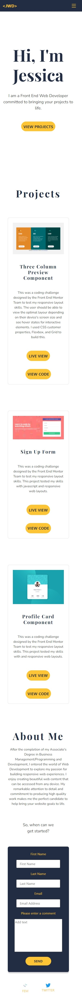

# Jessica's Web Development

## Overview

I created this portfolio to demonstrate the web development skills that I have learned over the course of the last two years.

I went from not knowing what HTML and CSS were to being able to build a responsive website from scratch.

## Table of Contents

- [Jessica's Web Development](#jessicas-web-development)
  - [Overview](#overview)
  - [Table of Contents](#table-of-contents)
    - [My Approach](#my-approach)
    - [Design](#design)
    - [Technologies](#technologies)
    - [What I have Learned](#what-i-have-learned)
    - [Future Development](#future-development)
    - [Acknowledgements](#acknowledgements)
    - [Helpful Resources](#helpful-resources)
    - [Images](#images)
    - [Version Updates](#version-updates)
      - [Version 1.0.1](#version-101)

### My Approach

 I really like the use of yellow because of the feelings it brings me. I wanted my portfolio to be a place that brings happiness. Yellow does that for me. However, I realize that yellow might be too bright and overwhelming of a color, so I used it sparingly as an accent through my site

``$accent-color:#FDC435;`` <!-- Yellow-->

 I chose Dark Blue for headings and navigation background because I wanted a color that would stand out, but still be neutral and sophisticated, while staying away from the overused black. 

``$heading-color:  #222d44;``<!--Dark Blue-->

I chose a Dark Gray for the main text because the using black on white background can be too harsh on the eyes. I still wanted the text to be legible while promoting that clean feeling that black on white does.

``$text-color: #3D3D3D;`` <!--Dark Gray-->

The last color I chose was white. I really wanted to only choose three colors, but none of the previous colors provided me with the same organized, professional feeling when used as a bakcground for the entire website.

``$bg-color: #FFFFFF;`` <!--White-->

### Design

I understand that being connected and easily able to access information on the web from any location is very important in our society. As such, my primary focus was on the mobile design, however, my website works well on Desktop too. 

### Technologies

 * HTML5: I used semantic HTML5 for the content to increase accessibility for assistive technologies.

* SASS/SCSS: I used SASS, but more specifically SCSS because I really like the modularity that it provides. With SASS I was able to break down each section of my site so that it is not only easier to read and mantain, but also to change and grow.

* Bootstrap 5: The main reason I used Bootstrap 5 was for the practice and to show that I can do it. I appreciate how Bootstrap make some things easier to implement, such as a functional navigation menu, however, I highly dislike the clutter in my HTML. I prefer to write my own styles, which is why there is a lot of SASS in my build.

* Flexbox: I used Flexbox for the mobile and table layouts. Since the mobile and tablet layouts are only one column, I felt that it was the right choice. 

### What I have Learned

 What you see now is a clean, beautiful, responsive website. What you don't see, is the many times that I started and failed before arriving at this solution. Honestly, I forgot my own principle at times: Keep It Simple but Effective. Or my other favorite: Keep It Simple, Stupid. I undoubtedly tried to bite  more than I can chew, which led to some astronomical failures.

 So I went back to the beggining. I learned the importance of scalability. It is OK that my first portfolio is not a masterpiece, in fact, I would go as far as saying that's the beauty of it. Before you roll your eyes at the cheesyness or furrow your eyebrows in confusion, hear me out. If it's not already a masterpiece, that means there is still so room for improvement. It can grow as I grow and each iteration will be a reflection of how far I have come. Isn't that beautiful?

 I also learned to be fearless and take moderate risks. I pushed myself to use version control from the command line and Oh Boy, let me tell you!  It was easier than I expected, but also challenging in some ways. Not having the visual was definitely the hardest part, but when I successfully pushed my commits to the remote repository, it was such a good feeling!

 One last thing that I learned was to use a package manager. I definitely did not use it to the best of it's ability, but getting started with it was the first step. Again, in this I also tried to bite more than I can chew several times. But thanks to the other lesson I learned, I know that proficiency will come in time 

### Future Development

 I am currently working on Colt Steele's Web Development Bootcamp 2022 on Udemy. I'm only about 30% of the way through, so I will continue to work on that. Throughout the course I will pick up the MERN stack, so I would like to build projects with that technology stack to change out the projects in my portfolio

 I will continue to practice my front-end skills and be active on Front End Mentor.

Specific to my portfolio, I would like to add different design templates to choose from, just for fun and practice. But first, I need more Javascript 
:smile: 
 

### Acknowledgements

The Front End Mentor community has served as a great place to get feedback on my code and also to serve as a mentor to others. Even their simple designs have a tricky aspect to them which allows me to learn new things and reinforce what I already know. Without their challenges and feedback I would still be stuck in tutorial hell, so shoutout to the FEM community for their continued support.

### Helpful Resources

- [MDN Web Docs - Client-Side Form Validation](https://developer.mozilla.org/en-US/docs/Learn/Forms/Form_validation) - This site was very helpful in helping implement some type of validation for my contact form.

### Images

### Version Updates

#### Version 1.0.1

* Add client-side form validation.
* Add mobile responsiveness to "About" section